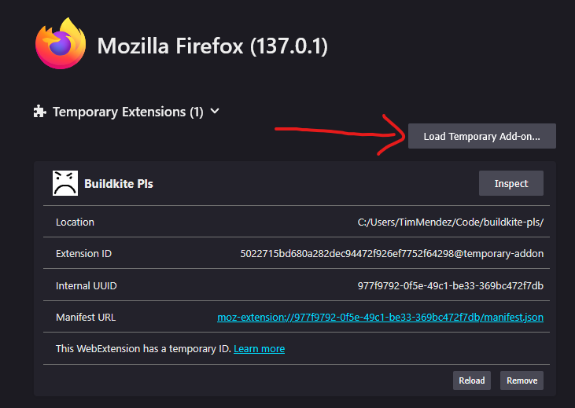

# Buildkite pls
Browser extensions/plugins to polyfill features into Buildkite because BUILDKITE PLS.

Specifically designed to work with [Pragma's](https://pragma.gg) deployment options.

## Firefox
You can install from the official release: https://addons.mozilla.org/en-US/firefox/addon/buildkite-pls/

Or you can install it as a temporary add-on:
1. Navigate to about:debugging#/runtime/this-firefox
2. Press `Load Temporary Add-on..`

3. Select `buildkite-pls/firefox/manifest.json`
4. Refresh your Buildkite page

## Chrome
1. Navigate to chrome://extensions/
2. Press `Load unpacked`
3. Select `buildkite-pls/firefox-and-chrome/` as the directory.
4. Refresh your Buildkite page

There is no official release in the Chrome Web Store.

## Demo
[Confluence](https://evegames.atlassian.net/wiki/spaces/CR/pages/1592426599/How+to+use+Buildkite+Pls) - For EVE friends only, sorry! The demo leaks sensitive info.
